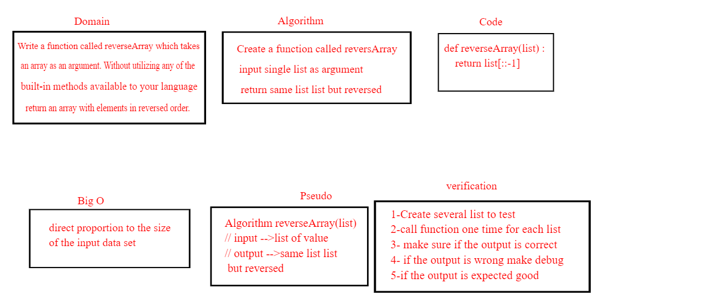

# Data Structures and Algorithms

## Language: `Python`

# Table of contents

## 1. Reverse an Array

Write a function called reverseArray which takes an array as an argument. Without utilizing any of the built-in methods available to your language, return an array with elements in reversed order.

## Whiteboard Process

## Approach & Efficiency

I make i simple by creating a function that takes list as argument 
Big O  was in direct proportion to the size of the input data set